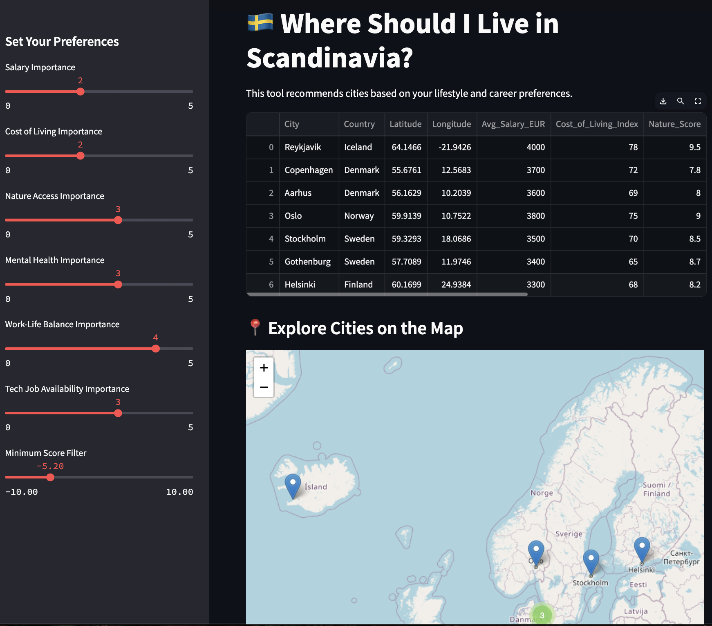

# 🌍 Where Should I Live in Scandinavia?

A **Streamlit app** that helps you find the best Scandinavian city to live in based on your personal and professional priorities — whether it's salary, access to nature, tech job opportunities, or mental well-being.

## 🚀 Features

- 🌆 Compares cities across **Sweden, Norway, Denmark, Finland, and Iceland**
- 🎯 Customize your preferences with **sliders** (salary, cost of living, work-life balance, etc.)
- 🔍 Calculates a **personalized score** for each city
- 🗺️ View cities on an **interactive map** with pop-up info
- 🎛️ Filter results by **minimum score threshold**
- 📊 See results in a dynamic table sorted by best match

## 📸 Screenshots



## 🧠 How It Works

1. **Standardized** numeric metrics such as salary, nature score, tech job opportunities, and more.
2. Users assign **weights** to each factor based on their preferences.
3. A **composite score** is calculated for each city.
4. Results are displayed in a table and interactive map.

## 🛠️ Installation

Make sure you have Python 3.8+ installed.

```bash
# Clone the repo
git clone https://github.com/Nynor-code/scandinavia-city-picker.git
cd scandinavia-city-picker

# Install dependencies
pip install -r requirements.txt
```

## 📦 Run the App

```bash
streamlit run streamlit_app.py
```

Then open your browser at `http://localhost:8501`.

## 🌐 Deployment

The app is deployed on **Streamlit Cloud**, and you can access it directly here:

[Streamlit Cloud Deployment](https://share.streamlit.io/Nynor-code/scandinavia-city-picker/main/)

## 📁 Project Structure

```
├── streamlit_app.py     # Main application file
├── requirements.txt     # Python dependencies
├── README.md            # This file
```

## ✅ Dependencies

- `streamlit`
- `pandas`
- `folium`
- `streamlit-folium`
- `scikit-learn`

Install with:
```bash
pip install streamlit pandas folium streamlit-folium scikit-learn
```

## 🌱 Future Improvements

- Export recommendations (CSV, PDF)
- Add city profile cards with photos
- Support user accounts to save preferences
- Pull real-time data from APIs (cost, jobs, etc.)

## 📍 Inspiration

Created as part of a **Nordic-themed portfolio project** to support relocation decisions for tech professionals seeking better work-life balance and nature access.

## 🧑‍💻 Author

Developed by [Nynor-code](https://github.com/Nynor-code).
